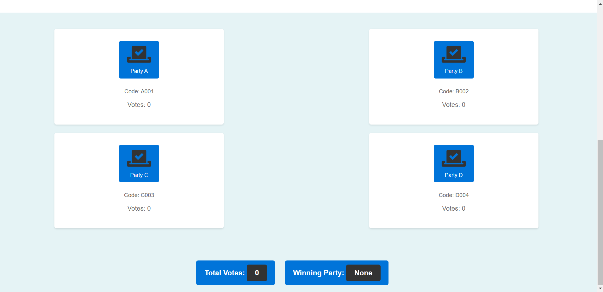

# Electronic Voting Machine (EVM)

Welcome to the Electronic Voting Machine (EVM) project, developed for the CodeTheVote competition. This project provides a web-based platform for conducting electronic voting, allowing users to vote for different parties and displaying real-time voting results.

## About

This project aims to provide a reliable and efficient solution for conducting elections in a democratic and transparent manner. The EVM system ensures the integrity of the voting process while providing convenience and accessibility to voters. With advanced technology and robust security measures, the goal is to facilitate fair and accurate elections.

## Features

- **Voting Interface:** Users can vote for their preferred party by clicking on the respective party button.
- **Real-time Vote Count:** The system displays the total number of votes cast for each party in real-time.
- **Dynamic Result Display:** The winning party is dynamically updated based on the current vote count.
- **Responsive Design:** The web interface is designed to be responsive and accessible across various devices.

## Team Members
- [Pragyan Sharma](https://github.com/Pragyan1510)
- [Alorika Jain](https://github.com/BLACKACE13) 
- [Kabir Kohli](https://github.com/kabirkohli123) 
- [Sarthak Jain](https://github.com/905Sarthak)

